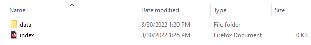
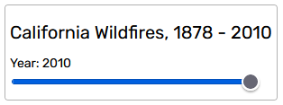
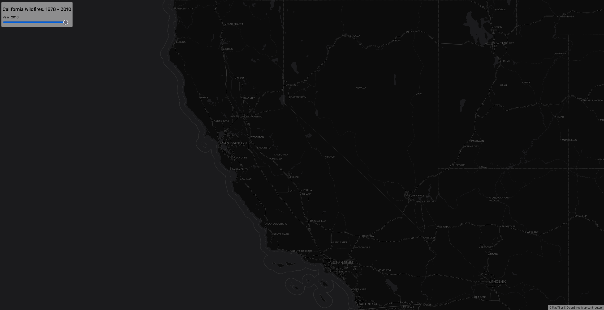
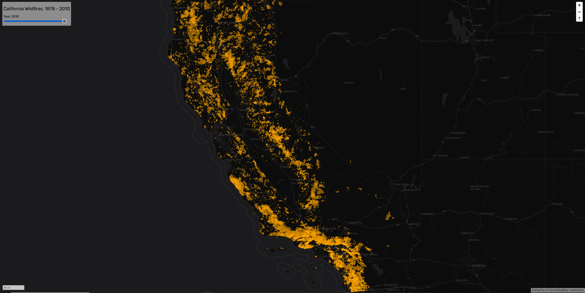
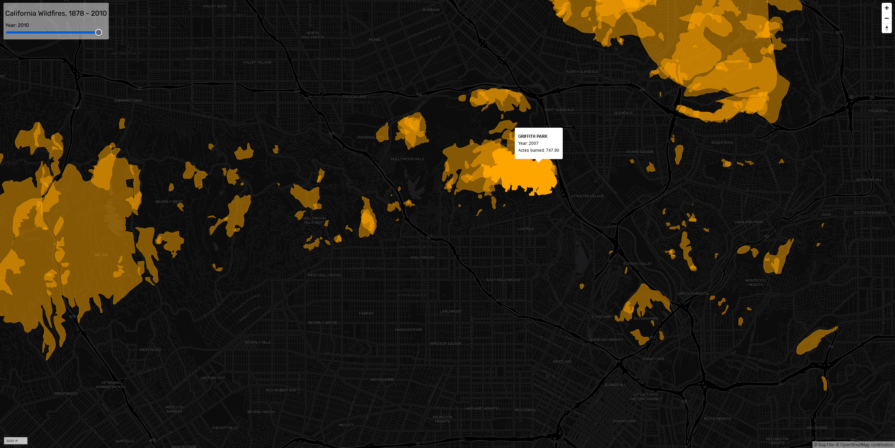
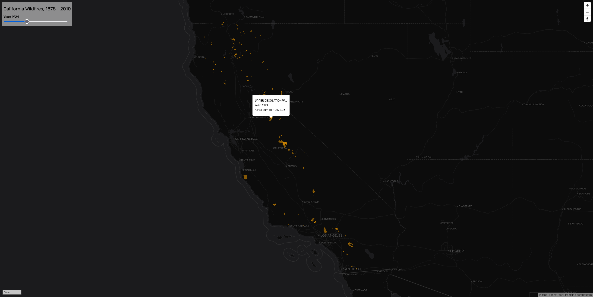

# MapLibre GL JS and Big Vector Data
How to map large geojson data sources on the web using vector tiles and MapLibre GL JS, an open-source version of Mapbox GL JS.

## Contents

- [Introduction](#introduction)
- [Download the California Wildfires Data](#download-the-california-wildfires-data)
- [Method 1: Vector Tiles from GeoJSON On the Fly](#method-1-vector-tiles-from-geojson-on-the-fly)
  - [Prepare the HTML Boilerplate](#prepare-the-html-boilerplate)
  - [Add a Title Bar and Time Slider](#add-a-title-bar-and-time-slider)
  - [Add Vector Base Tiles](#add-vector-base-tiles)
  - [Adding GeoJSON Files as Vector Tiles On the Fly](#adding-geojson-files-as-vector-tiles-on-the-fly)
  - [Display Popup on Mouse Hover](#display-popup-on-mouse-hover)
  - [Filter Geojson Data with the Time Slider](#filter-geojson-data-with-the-time-slider)
- [Method 2: Pre-Generated and Styled Vector Tiles](#method-2-pre-generated-and-styled-vector-tiles)
  - [Generate Vector Tiles from GeoJSON Files](#generate-vector-tiles-from-geojson-files)
  - [Create a Style for the Vector Tiles](#create-a-style-for-the-vector-tiles)
  - [Edit MapLibre GL JavaScript](#edit-maplibre-gl-javascript)

## Introduction
Occasionally you have a large geojson file you want to include in a web map application, but it slows down your map even after implementing various file simplification techniques. Instead of trying all forms of file resizing to fit your data in a Leaflet map, you can convert your geojson file into vector tiles and build an interactive map using the MapLibre GL JS library with all the same functionality. The following is a step-by-step walkthrough of two methods for incorporating large geojson files as vector tiles in MapLibre GL JS using [more than a century of California wildfire data](https://services.gis.ca.gov/arcgis/rest/services/Environment/Wildfires/MapServer). You will see how to process these data as vector tiles and then filter them by year using a time slider. You will also learn how to add popup content to allow users to query the wildfire polygons.

## Download the California Wildfires Data
First, [download this repository](https://github.com/jebowe3/maplibre-gl-js-demo/archive/refs/heads/main.zip). Inside is a folder called "map". All of the data and code are within, and you can simply look at this for reference or build your own map from the ground up using the instructions that follow.

Create a folder structure as follows for your project, creating an index.html file at the root and a subdirectory called "data" to hold the geojson file.

  
**Figure 01**. How to Organize Your Project.

Inside the data folder within the map folder, grab the calWildfires.geojson file and add this to your own project folder in your "data" subdirectory. You will notice that this file is a little more than 40 MB and quite a bit larger than the maximum file size recommended for Leaflet maps.

## Method 1: Vector Tiles from GeoJSON On the Fly
### Prepare the HTML Boilerplate

Now, open your blank index.html file and set it up to handle vector tiles with MapLibre.

```HTML
<!DOCTYPE html>
<html>

<head>
  <meta charset='utf-8' />
  <title>California Wildfires</title>
  <meta name='viewport' content='initial-scale=1,maximum-scale=1,user-scalable=no' />

  <!-- maplibre-gl.css here -->
  <link href='https://unpkg.com/maplibre-gl@2.1.7/dist/maplibre-gl.css' rel='stylesheet' />
  <!-- Rubik font -->
  <link href="https://fonts.googleapis.com/css?family=Rubik&display=swap" rel="stylesheet">

  <style>
    /* basic css to style the viewer goes here */
    body {
      margin: 0;
      padding: 0;
    }

    #map {
      position: absolute;
      top: 0;
      bottom: 0;
      width: 100%;
    }

  </style>

</head>

<body>

  <!-- id the map div -->
  <div id='map'></div>

  <!-- maplibre-gl.js library -->
  <script src='https://unpkg.com/maplibre-gl@2.1.7/dist/maplibre-gl.js'></script>

  <script>
    // javascript goes here
  </script>

</body>  
```

The code above references our necessary MapLibre css and javascript libraries, adds Rubik font from Google, defines the map div, and styles the map and body with some basic css.

### Add a Title Bar and Time Slider

Before going too much further, we should add a title and time slider element so that our map is prepared to handle this filtration later. Within the body tags, and just beneath the code identifying the map div, add and id another div for the title and time slider.

```html
  <!-- id the map div -->
  <div id='map'></div>

  <!-- title and time slider -->
  <div class='session' id='sliderbar'>
    <!-- the shown title of the map -->
    <h1>California Wildfires, 1878 - 2010</h1>
    <div class='container'>
      <!-- the selected year -->
      <h2>Year: <label id='active-year'>2010</label></h2>
    </div>
    <!-- the slider has a range from 1878 to 2010, intervals of 1 year, and an initial value of 2010 -->
    <input id='slider' class='row' type='range' min='1878' max='2010' step='1' value='2010' />
  </div>
```

Now we need to style this content with some css within the style tags.

```HTML
  <style>
    /* basic css to style the viewer goes here */
    body {
      margin: 0;
      padding: 0;
    }

    #map {
      position: absolute;
      top: 0;
      bottom: 0;
      width: 100%;
    }

    /* set styles for the container holding the title and slider */
    .session {
      position: absolute;
      z-index: 1;
      background-color: rgba(255, 255, 255, 0.5);
      border-radius: 3px;
      box-shadow: 0px 0px 0px 1px rgba(0, 0, 0, 0.3);
      top: 10px;
      left: 10px;
      padding: 5px;
    }

    /* set styles for the container holding the year legend */
    .container {
      display: table;
      width: 100%;
      margin: 0;
    }

    /* set font styles for the title */
    h1 {
      font-size: 20px;
      font-family: 'Rubik', sans-serif;
      padding-bottom: 0px;
      padding-top: 0px;
      font-weight: normal;
    }

    /* set font styles for the identified year */
    h2 {
      cursor: pointer;
      font-size: 14px;
      font-family: 'Rubik', sans-serif;
      padding-bottom: 0px;
      padding-top: 0px;
      font-weight: normal;
      width: 50%;
      text-align: left;
      display: table-cell;
    }

    /* define the slider width and change the cursor to a pointer on hover */
    #slider {
      cursor: pointer;
      width: 275px;
    }

  </style>
```

Upon refresh, the result should look like this:

  
**Figure 02**. Title and Time Slider.

### Add Vector Base Tiles

Now that we have a title, we should add a base map to our blank map screen for some spatial context. Within the script tags, insert the following javascript.

```html
  <script>
    // javascript goes here

    // your maptiler key
    const key = 'X79IRuovndFj8moKWjAt'

    // define the style.json for the vector tiles here
    const style = 'https://api.maptiler.com/maps/darkmatter/style.json?key=' + key

    // define the map
    const map = new maplibregl.Map({
      container: 'map',
      bounds: [[-124.48,32.53],[-114.13,42.01]], // the coordinate boundaries of California
      maxZoom: 9,
      style: style
    });
  </script>
```

Unlike raster tile providers, most vector tiles currently sit behind a paywall or require a personal api key to use. Fortunately, Maptiler offers open-source vector base tiles, but you will need to [sign up for a free account](https://cloud.maptiler.com/maps/). Once you do, you can find your api key by clicking your "Account" tab. The nice thing about this service is that you can add new keys that only work for certain domains. This way, no one else can steal your key from GitHub to use for a map hosted elsewhere.

In the code above, we have added maptiler's darkmatter style. If you are successful, the map should now look like this:

  
**Figure 03**. Dark Matter Vector Tiles.

We can build on this a little and add a few preliminary interactive controls.

```html
  <script>
    // javascript goes here

    // your maptiler key
    const key = 'X79IRuovndFj8moKWjAt'

    // define the style.json for the vector tiles here
    const style = 'https://api.maptiler.com/maps/darkmatter/style.json?key=' + key

    // define the map
    const map = new maplibregl.Map({
      container: 'map',
      bounds: [[-124.48,32.53],[-114.13,42.01]], // the coordinate boundaries of California
      maxZoom: 9,
      style: style
    });

    // add zoom and rotation controls to the map.
    map.addControl(new maplibregl.NavigationControl());

    // add a scale bar
    map.addControl(new maplibregl.ScaleControl({
      position: 'bottom-left',
      unit: 'imperial' // you can change from imperial to metric, if desired
    }));

  </script>
```

After saving and refreshing the map, you should now notice a scale bar in the bottom left corner and a zoom and rotation control in the upper right corner.

### Adding GeoJSON Files as Vector Tiles On the Fly

The first method to add geojson as vector tiles uses MapLibre GL JS to handle the processing on the fly. This is the easiest method, but is slower and less responsive in the browser than the second method I will demonstrate. Still, it is pretty good at handling large files.

First, let's add D3.js to our available scripting libraries underneath the address for the MapLibre GL JS library. This will help simplify access to our data.

```HTML
  <!-- maplibre-gl.js library -->
  <script src='https://unpkg.com/maplibre-gl@2.1.7/dist/maplibre-gl.js'></script>

  <!-- d3 js -->
  <script src="https://d3js.org/d3.v6.min.js"></script>
```

Next, just after the javascript adding the scale bar, signal to the application to call a function when the map loads to bring in our geojson data.

```js
    // add a scale bar
    map.addControl(new maplibregl.ScaleControl({
      position: 'bottom-left',
      unit: 'imperial' // you can change from imperial to metric, if desired
    }));

    // when the map loads, call a function
    map.on('load', () => {

      // define incoming geojson data
      const calwf = d3.json('./data/calWildfires.geojson');

      // promise to wait until geojson files are loaded
      Promise.all([calwf]).then((data) => {

        // define the data according to its order in object array
        const wildfires = data[0];

        // add the source to the map
        map.addSource('wildfires', {
          type: 'geojson',
          data: wildfires // use our data as the data source
        });
        // add the GeoJSON data as a mapbox gl layer
        map.addLayer({
          'id': 'wildfires',
          'type': 'fill',
          'source': 'wildfires', // refers to source above
          'layout': {},
          "paint": {
            "fill-color":"orange",
            "fill-opacity": 0.5
          }
        });

      });

    });
```

Upon saving and refreshing, your map should now have all the wildfire polygons in semi-transparent orange displayed on top of the dark matter vector tiles. Maplibre GL JS is creating vector tiles from the geojson data on the fly. You will know this because the complexity of the polygons increases as you zoom in and decreases as you zoom out. The result should look something like this:

  
**Figure 04**. Wildfires over Dark Matter.

### Display Popup on Mouse Hover

Before tackling the more complicated time slider filtration interactivity, let's add and display popup content when the user hovers over each polygon. For this, we will need to write a function that parses the geojson attribute data and returns the information we want to the popup. First, we need to write some code to display an empty popup. Just after the method adding the scale bar and just before the function called after the map loads, we will define a popup and define the initial hover state id.

```js
    // add a scale bar
    map.addControl(new maplibregl.ScaleControl({
      position: 'bottom-left',
      unit: 'imperial' // you can change from imperial to metric, if desired
    }));

    // create a popup without adding to map
    let popup = new maplibregl.Popup({
      closeButton: false,
      closeOnClick: false
    });

    // define initial hover state
    let hoveredStateId = null;
```

Next, below the entire block function called on map loading (the very bottom of our code outside this function and just before the closing script tags), we add a function to fire upon moving the mouse over the wildfires layer. For this, we will reference the wildfires layer with the id we gave it when you added it to the map. We will also add some code that will change the cursor to a pointer when we hover over the layer, followed by some code to change the hover state id. This lets the layer know when to change its opacity value. We will also need to define the feature properties ("props" here) in order to access this data for the popup defined in the following code.

```js
    // fire a function on a mousemove and feed it the geojson we gave an id of 'wildfires'
    map.on('mousemove','wildfires', (e) => {

      // change the cursor style as a UI indicator.
      map.getCanvas().style.cursor = 'pointer';

      // reset the hover state id on mouse move so the layer knows when to change opacity
      if (e.features.length > 0) {
        if (hoveredStateId !== null) {
          map.setFeatureState(
            { source: 'wildfires', id: hoveredStateId },
            { hover: false }
          );
        }
        hoveredStateId = e.features[0].id;
        map.setFeatureState(
          { source: 'wildfires', id: hoveredStateId },
          { hover: true }
        );
      }

      // define the layer properties
      // with "e.features[0].properties," you have access to all of the properties from the initial geojson layer
      let props = e.features[0].properties;

      // get the popup defined above
      popup
        .setLngLat(e.lngLat) // the location of the cursor
        .setHTML(/*We will put the popup content here in HTML code*/) // feed the popup the prop info
        .addTo(map) // add the popup to the map

    });
```

After saving and refreshing your map, you should now see a popup with the word "undefined" appear when you hover over the wildfire polygons. Three issues exist: 1.) we need to add information to the popup, 2.) we need to change the opacity value back to the original value, and 3.) we need to add some code to close the popup after the mouse leaves the wildfires layer. Just beneath the ```map.on('mousemove','wildfires', (e) => {});``` code block, let's add another code block to reset opacity by reverting to the original hover state id and to remove the popup on mouse leave.

```js
    // when you mouse off the layer...
    map.on('mouseleave', 'wildfires', () => {

      // change the cursor style back to initial setting
      map.getCanvas().style.cursor = '';

      // reset the hover state id
      if (hoveredStateId !== null) {
        map.setFeatureState(
          { source: 'wildfires', id: hoveredStateId },
          { hover: false }
        );
      }
      hoveredStateId = null;

      // and remove the popup
      popup.remove();

    });
```

Now, the popup disappears when your cursor leaves the layer. However, we still need to add relevant feature properties to the popup. If you open the geojson file, you can see that there are properties for "YEAR_", "FIRE_NAME", and "GIS_ACRES". These all look like good content for the popup. Return to the ```.setHTML()``` section of the popup code and build it out as follows:

```js
      // get the popup defined above
      popup
        .setLngLat(e.lngLat) // the location of the cursor
        .setHTML('<b>' + props.FIRE_NAME + '</b><br>Year: ' + props.YEAR_ + '<br>Acres burned: ' + props.GIS_ACRES.toFixed(2)) // feed the popup the prop info
        .addTo(map) // add the popup to the map
```

Now, your map should display the fire name, year, and acres burned when you hover over a wildfire polygon. This is nice, but we also want to change the layer style on hover so that we know which shape corresponds to the fire for which we see popup information. Fortunately, this is pretty easy in Maplibre GL JS. To do this, all we need to do is return to the ```map.addLayer({});``` method and edit the layer options. To change the polygon opacity from 0.5 to 1.0 on hover, all we need to do is to edit the code as follows:

```js
        // add the GeoJSON data as a mapbox gl layer
        map.addLayer({
          'id': 'wildfires',
          'type': 'fill',
          'source': 'wildfires', // refers to source above
          'layout': {},
          "paint": {
            "fill-color":"orange",
            "fill-opacity": [
              'case',
              ['boolean', ['feature-state', 'hover'], false],
              1.0,
              0.5
            ]
          }
        });
```

There is one caveat to all of this; it only works if your geojson has a unique feature id (not a property id) for each feature in this format: ```"type": "Feature", "id": 1```. Take a look at [this stackoverflow forum](https://stackoverflow.com/questions/34314066/adding-a-unique-feature-id-to-geojson-in-qgis-or-python) for how to add this using QGIS if your data does not have this id.

The result should look like the image below.


**Figure 05**. Popup and Shading on Hover.

### Filter Geojson Data with the Time Slider

One of the issues with the current visualization is that all of the wildfires appear at once and overlap. The presentation is confusing and many fires are hidden behind later fires. Using the existing time slider, we are going to filter the polygons so that only the fires for the selected year appear on the screen.

First, at the very bottom of the script after the function fired by the mouseleave event, we will write a new function that will be fired upon an input change in the time slider.

```js
    // listen for a slider input
    document.getElementById('slider').addEventListener('input', (event) => {

      // define the newly-selected year
      const year = event.target.value;

      // update text in the UI
      document.getElementById('active-year').innerText = year;

      // set a filter on the wildfires layer that tests for a match between each feature's year and the year identified by the time slider
      map.setFilter('wildfires', ['==', ['string', ['get', 'YEAR_']], year]);

    });
```

With this block of code, the slider interacts with the year legend and the geojson data. Now you should see both the year change in the legend above the slider as well as the wildfire polygons filtering as you drag the slider. The image below shows all fires filtered to show only those that occurred in 1924.

  
**Figure 06**. Temporal Filtration.

This works, but all of the wildfire polygons still display when the map loads, so we need to go back and add the filter to the layer when it is first added to the map. At the very top of your script, just above ```const key```, add the following code to identify the initial year selected with the time slider and to change the year legend to reflect this year.

```js
// define the initial slider-selected year
const initYear = document.getElementById('slider').value;

// update text in the UI
document.getElementById('active-year').innerText = initYear;

// your maptiler key
const key = 'X79IRuovndFj8moKWjAt'
```

Next, filter your data on initial loading by adding the following filter option to ```map.addLayer({});```.

```js
        // add the GeoJSON data as a mapbox gl layer
        map.addLayer({
          'id': 'wildfires',
          'type': 'fill',
          'source': 'wildfires', // refers to source above
          'layout': {},
          "paint": {
            "fill-color":"orange",
            "fill-opacity": [
              'case',
              ['boolean', ['feature-state', 'hover'], false],
              1.0,
              0.5
            ]
          },
          "filter": ['==', ['string', ['get', 'YEAR_']], initYear]
        });
```  

You should now have [a web map application that generates vector tiles from heavy geojson data on the fly using MapLibre GL JS](https://jebowe3.github.io/maplibre-gl-js-demo/map/geojson.html). In case you mixed up anything, the following consists of the entire code used to generate this map. If you would like to see another, slightly more complicated, technique that speeds up your map by converting your geojson data to vector tiles before loading, skip the following code and follow the instructions in the next section.

```html
<!DOCTYPE html>
<html>

<head>
  <meta charset='utf-8' />
  <title>California Wildfires</title>
  <meta name='viewport' content='initial-scale=1,maximum-scale=1,user-scalable=no' />

  <!-- maplibre-gl.css here -->
  <link href='https://unpkg.com/maplibre-gl@2.1.7/dist/maplibre-gl.css' rel='stylesheet' />
  <!-- Rubik font -->
  <link href="https://fonts.googleapis.com/css?family=Rubik&display=swap" rel="stylesheet">

  <style>
    /* basic css to style the viewer goes here */
    body {
      margin: 0;
      padding: 0;
    }

    #map {
      position: absolute;
      top: 0;
      bottom: 0;
      width: 100%;
    }

    /* set styles for the container holding the title and slider */
    .session {
      position: absolute;
      z-index: 1;
      background-color: rgba(255, 255, 255, 0.5);
      border-radius: 3px;
      box-shadow: 0px 0px 0px 1px rgba(0, 0, 0, 0.3);
      top: 10px;
      left: 10px;
      padding: 5px;
    }

    /* set styles for the container holding the year legend */
    .container {
      display: table;
      width: 100%;
      margin: 0;
    }

    /* set font styles for the title */
    h1 {
      font-size: 20px;
      font-family: 'Rubik', sans-serif;
      padding-bottom: 0px;
      padding-top: 0px;
      font-weight: normal;
    }

    /* set font styles for the identified year */
    h2 {
      cursor: pointer;
      font-size: 14px;
      font-family: 'Rubik', sans-serif;
      padding-bottom: 0px;
      padding-top: 0px;
      font-weight: normal;
      width: 50%;
      text-align: left;
      display: table-cell;
    }

    /* define the slider width and change the cursor to a pointer on hover */
    #slider {
      cursor: pointer;
      width: 275px;
    }

  </style>

</head>

<body>

  <!-- id the map div -->
  <div id='map'></div>

  <!-- title and time slider -->
  <div class='session' id='sliderbar'>
    <!-- the shown title of the map -->
    <h1>California Wildfires, 1878 - 2010</h1>
    <div class='container'>
      <!-- the selected year -->
      <h2>Year: <label id='active-year'>2010</label></h2>
    </div>
    <!-- the slider has a range from 1878 to 2010, intervals of 1 year, and an initial value of 2010 -->
    <input id='slider' class='row' type='range' min='1878' max='2010' step='1' value='2010' />
  </div>

  <!-- maplibre-gl.js library -->
  <script src='https://unpkg.com/maplibre-gl@2.1.7/dist/maplibre-gl.js'></script>

  <!-- d3 js -->
  <script src="https://d3js.org/d3.v6.min.js"></script>

  <script>
    // javascript goes here

    // define the initial slider-selected year
    const initYear = document.getElementById('slider').value;

    // update text in the UI
    document.getElementById('active-year').innerText = initYear;

    // your maptiler key
    const key = 'X79IRuovndFj8moKWjAt'

    // define the style.json for the vector tiles here
    const style = 'https://api.maptiler.com/maps/darkmatter/style.json?key=' + key

    // define the map
    const map = new maplibregl.Map({
      container: 'map',
      bounds: [[-124.48,32.53],[-114.13,42.01]], // the coordinate boundaries of California
      maxZoom: 9,
      style: style
    });

    // add zoom and rotation controls to the map.
    map.addControl(new maplibregl.NavigationControl());

    // add a scale bar
    map.addControl(new maplibregl.ScaleControl({
      position: 'bottom-left',
      unit: 'imperial' // you can change from imperial to metric, if desired
    }));

    // create a popup without adding to map
    let popup = new maplibregl.Popup({
      closeButton: false,
      closeOnClick: false
    });

    // define initial hover state
    let hoveredStateId = null;

    // when the map loads, call a function
    map.on('load', () => {

      // define incoming geojson data
      const calwf = d3.json('./data/calWildfires.geojson');

      // promise to wait until geojson files are loaded
      Promise.all([calwf]).then((data) => {

        // define the data according to its order in object array
        const wildfires = data[0];

        // add the source to the map
        map.addSource('wildfires', {
          type: 'geojson',
          data: wildfires // use our data as the data source
        });
        // add the GeoJSON data as a mapbox gl layer
        map.addLayer({
          'id': 'wildfires',
          'type': 'fill',
          'source': 'wildfires', // refers to source above
          'layout': {},
          "paint": {
            "fill-color":"orange",
            "fill-opacity": [
              'case',
              ['boolean', ['feature-state', 'hover'], false],
              1.0,
              0.5
            ]
          },
          "filter": ['==', ['string', ['get', 'YEAR_']], initYear]
        });

      });

    });

    // fire a function on a mousemove and feed it the geojson we gave an id of 'wildfires'
    map.on('mousemove','wildfires', (e) => {

      // change the cursor style as a UI indicator.
      map.getCanvas().style.cursor = 'pointer';

      // reset the hover state id on mousemove so the layer knows when to change opacity
      if (e.features.length > 0) {
        if (hoveredStateId !== null) {
          map.setFeatureState(
            { source: 'wildfires', id: hoveredStateId },
            { hover: false }
          );
        }
        hoveredStateId = e.features[0].id;
        map.setFeatureState(
          { source: 'wildfires', id: hoveredStateId },
          { hover: true }
        );
      }

      // define the layer properties
      // with "e.features[0].properties," you have access to all of the properties from the initial geojson layer
      let props = e.features[0].properties;

      // get the popup defined above
      popup
        .setLngLat(e.lngLat) // the location of the cursor
        .setHTML('<b>' + props.FIRE_NAME + '</b><br>Year: ' + props.YEAR_ + '<br>Acres burned: ' + props.GIS_ACRES.toFixed(2)) // feed the popup the prop info
        .addTo(map) // add the popup to the map

    });

    // when you mouse off the layer...
    map.on('mouseleave', 'wildfires', () => {

      // change the cursor style back to initial setting
      map.getCanvas().style.cursor = '';

      // reset the hover state id
      if (hoveredStateId !== null) {
        map.setFeatureState(
          { source: 'wildfires', id: hoveredStateId },
          { hover: false }
        );
      }
      hoveredStateId = null;

      // and remove the popup
      popup.remove();

    });


    // listen for a slider input
    document.getElementById('slider').addEventListener('input', (event) => {

      // define the newly-selected year
      const year = event.target.value;

      // update text in the UI
      document.getElementById('active-year').innerText = year;

      map.setFilter('wildfires', ['==', ['string', ['get', 'YEAR_']], year]);

    });

  </script>

</body>
```
## Method 2: Pre-Generated and Styled Vector Tiles
### Generate Vector Tiles from GeoJSON Files

To do this, you will need [tippecanoe](https://github.com/mapbox/tippecanoe), [mbutil](https://github.com/mapbox/mbutil), and MacOS or Linux.

Using tippecanoe, we will convert our calWildfires.geojson file to a mbtiles files. On MacOS, open Terminal, cd to the data folder (```cd my/data/folder/path```), and input the following command (provided you have installed tippecanoe):

```bash
tippecanoe -zg -o calWildfires.mbtiles calWildfires.geojson
```

You should now see a file named "calWildfires.mbtiles" in your data folder. From this file, you can create a directory of vector tiles in pbf format with mbutil (you will need to install this too). Return to Terminal and input the following:

```bash
mb-util --image_format=pbf calWildfires.mbtiles wildfires
```

With this, you should see a new directory called "wildfires" in your data folder. Inside this, you should notice subdirectories filled with pbf tiles for each zoom level. Next, you need to run gzip on the pbf files to unzip them for serving. Return to Terminal and type and enter the following:

```bash
cd wildfires
gzip -d -r -S .pbf *
find . -type f -exec mv '{}' '{}'.pbf \;
```

### Create a Style for the Vector Tiles

At this point, we need to define the style settings for our vector tiles. Part of the work is already done. In your code where you defined ```const style``` with a link to maptiler.com, copy that link along with your api code and paste it into your browser's address bar. You should see an option to view the raw json data at this address. Choose this option, copy the contents, and paste this into the style definition where the link was. You should "beautify" this code block for easier editing. You can minify it later when you are done.

Next, within this long style block locate the ```sources: {}``` block. After the "openmaptiles" source, we need to add a source for the vector tiles we just generated. Let's call this source "wildfires".

```js
"sources": {
  "openmaptiles": {
    "type": "vector",
    "url": "https://api.maptiler.com/tiles/v3/tiles.json?key=X79IRuovndFj8moKWjAt"
  },
  "wildfires": {
    "type": "vector",
    "tiles": [location.origin+location.pathname+"data/wildfires/{z}/{x}/{y}.pbf"]
  }
},
```

After adding these tiles as a source, we need to add and style a layer. Find the ```layers: []``` block and find the absolute end. Add another layer to the array using the following code:

```js
{
  "id": "wildfires",
  "type": "fill",
  "source": "wildfires",
  "source-layer": "calWildfires",
  "layout": {
    "visibility": "visible"
  },
  "minzoom": 0,
  "maxzoom": 10,
  "paint": {
    "fill-color":"orange",
    "fill-opacity": [
      'case',
      ['boolean', ['feature-state', 'hover'], false],
      1.0,
      0.5
    ]
  },
  "filter": ['==', ['string', ['get', 'YEAR_']], initYear]
}
```

### Edit MapLibre GL JavaScript

Finally, we need to edit the javascript in our index.html document. First, scroll down to the code block encapsulated by ```map.on('load', () => {});``` and delete the entire block, since we no longer need to load the geojson data with the map.

Now, find the three instances of the ```map.setFeatureState()``` method. Within these, we need to edit ```{ source: 'wildfires', id: hoveredStateId }``` so that it reads:

```js
     { source: 'wildfires', sourceLayer: 'calWildfires', id: hoveredStateId }
```

You should now have [a web map application that uses pregenerated and self-styled vector tiles from heavy geojson data using MapLibre GL JS](https://jebowe3.github.io/maplibre-gl-js-demo/map). The entirety of the resulting code should look like this:

```HTML
<!DOCTYPE html>
<html>

<head>
  <meta charset='utf-8' />
  <title>California Wildfires</title>
  <meta name='viewport' content='initial-scale=1,maximum-scale=1,user-scalable=no' />

  <!-- maplibre-gl.css here -->
  <link href='https://unpkg.com/maplibre-gl@2.1.7/dist/maplibre-gl.css' rel='stylesheet' />
  <!-- Rubik font -->
  <link href="https://fonts.googleapis.com/css?family=Rubik&display=swap" rel="stylesheet">

  <style>
    /* basic css to style the viewer goes here */
    body {
      margin: 0;
      padding: 0;
    }

    #map {
      position: absolute;
      top: 0;
      bottom: 0;
      width: 100%;
    }

    /* set styles for the container holding the title and slider */
    .session {
      position: absolute;
      z-index: 1;
      background-color: rgba(255, 255, 255, 0.5);
      border-radius: 3px;
      box-shadow: 0px 0px 0px 1px rgba(0, 0, 0, 0.3);
      top: 10px;
      left: 10px;
      padding: 5px;
    }

    /* set styles for the container holding the year legend */
    .container {
      display: table;
      width: 100%;
      margin: 0;
    }

    /* set font styles for the title */
    h1 {
      font-size: 20px;
      font-family: 'Rubik', sans-serif;
      padding-bottom: 0px;
      padding-top: 0px;
      font-weight: normal;
    }

    /* set font styles for the identified year */
    h2 {
      cursor: pointer;
      font-size: 14px;
      font-family: 'Rubik', sans-serif;
      padding-bottom: 0px;
      padding-top: 0px;
      font-weight: normal;
      width: 50%;
      text-align: left;
      display: table-cell;
    }

    /* define the slider width and change the cursor to a pointer on hover */
    #slider {
      cursor: pointer;
      width: 275px;
    }

  </style>

</head>

<body>

  <!-- id the map div -->
  <div id='map'></div>

  <!-- title and time slider -->
  <div class='session' id='sliderbar'>
    <!-- the shown title of the map -->
    <h1>California Wildfires, 1878 - 2010</h1>
    <div class='container'>
      <!-- the selected year -->
      <h2>Year: <label id='active-year'>2010</label></h2>
    </div>
    <!-- the slider has a range from 1878 to 2010, intervals of 1 year, and an initial value of 2010 -->
    <input id='slider' class='row' type='range' min='1878' max='2010' step='1' value='2010' />
  </div>

  <!-- maplibre-gl.js library -->
  <script src='https://unpkg.com/maplibre-gl@2.1.7/dist/maplibre-gl.js'></script>

  <!-- d3 js -->
  <script src="https://d3js.org/d3.v6.min.js"></script>

  <script>
    // javascript goes here

    // define the initial slider-selected year
    const initYear = document.getElementById('slider').value;

    // update text in the UI
    document.getElementById('active-year').innerText = initYear;

    // define the style.json for the vector tiles here
    const style = {
      "version": 8,
      "name": "Dark Matter",
      "metadata": {
        "mapbox:autocomposite": false,
        "mapbox:groups": {
          "101da9f13b64a08fa4b6ac1168e89e5f": {
            "collapsed": false,
            "name": "Places"
          },
          "a14c9607bc7954ba1df7205bf660433f": {
            "name": "Boundaries"
          },
          "b6371a3f2f5a9932464fa3867530a2e5": {
            "collapsed": false,
            "name": "Transportation"
          }
        },
        "mapbox:type": "template",
        "openmaptiles:mapbox:owner": "openmaptiles",
        "openmaptiles:mapbox:source:url": "mapbox://openmaptiles.4qljc88t",
        "openmaptiles:version": "3.x"
      },
      "sources": {
        "openmaptiles": {
          "type": "vector",
          "url": "https://api.maptiler.com/tiles/v3/tiles.json?key=X79IRuovndFj8moKWjAt"
        },
        "wildfires": {
          "type": "vector",
          "tiles": [location.origin+location.pathname+"data/wildfires/{z}/{x}/{y}.pbf"]
        }
      },
      "sprite": "https://api.maptiler.com/maps/darkmatter/sprite",
      "glyphs": "https://api.maptiler.com/fonts/{fontstack}/{range}.pbf?key=X79IRuovndFj8moKWjAt",
      "layers": [{
        "id": "background",
        "type": "background",
        "paint": {
          "background-color": "rgb(12,12,12)"
        }
      }, {
        "id": "water",
        "type": "fill",
        "source": "openmaptiles",
        "source-layer": "water",
        "filter": ["all", ["==", "$type", "Polygon"],
          ["!=", "brunnel", "tunnel"]
        ],
        "layout": {
          "visibility": "visible"
        },
        "paint": {
          "fill-antialias": false,
          "fill-color": "rgb(27 ,27 ,29)"
        }
      }, {
        "id": "landcover_ice_shelf",
        "type": "fill",
        "source": "openmaptiles",
        "source-layer": "landcover",
        "maxzoom": 8,
        "filter": ["all", ["==", "$type", "Polygon"],
          ["==", "subclass", "ice_shelf"]
        ],
        "layout": {
          "visibility": "visible"
        },
        "paint": {
          "fill-color": "rgb(12,12,12)",
          "fill-opacity": 0.7
        }
      }, {
        "id": "landcover_glacier",
        "type": "fill",
        "source": "openmaptiles",
        "source-layer": "landcover",
        "maxzoom": 8,
        "filter": ["all", ["==", "$type", "Polygon"],
          ["==", "subclass", "glacier"]
        ],
        "layout": {
          "visibility": "visible"
        },
        "paint": {
          "fill-color": "hsl(0, 1%, 2%)",
          "fill-opacity": {
            "base": 1,
            "stops": [
              [0, 1],
              [8, 0.5]
            ]
          }
        }
      }, {
        "id": "landuse_residential",
        "type": "fill",
        "source": "openmaptiles",
        "source-layer": "landuse",
        "maxzoom": 9,
        "filter": ["all", ["==", "$type", "Polygon"],
          ["==", "class", "residential"]
        ],
        "layout": {
          "visibility": "visible"
        },
        "paint": {
          "fill-color": "hsl(0, 2%, 5%)",
          "fill-opacity": 0.4
        }
      }, {
        "id": "landcover_wood",
        "type": "fill",
        "source": "openmaptiles",
        "source-layer": "landcover",
        "minzoom": 10,
        "filter": ["all", ["==", "$type", "Polygon"],
          ["==", "class", "wood"]
        ],
        "layout": {
          "visibility": "visible"
        },
        "paint": {
          "fill-color": "rgb(32,32,32)",
          "fill-opacity": {
            "base": 0.3,
            "stops": [
              [8, 0],
              [10, 0.8],
              [13, 0.4]
            ]
          },
          "fill-pattern": "wood-pattern",
          "fill-translate": [0, 0]
        }
      }, {
        "id": "landuse_park",
        "type": "fill",
        "source": "openmaptiles",
        "source-layer": "landuse",
        "filter": ["all", ["==", "$type", "Polygon"],
          ["==", "class", "park"]
        ],
        "layout": {
          "visibility": "visible"
        },
        "paint": {
          "fill-color": "rgb(32,32,32)"
        }
      }, {
        "id": "waterway",
        "type": "line",
        "source": "openmaptiles",
        "source-layer": "waterway",
        "filter": ["==", "$type", "LineString"],
        "layout": {
          "visibility": "visible"
        },
        "paint": {
          "line-color": "rgb(27 ,27 ,29)"
        }
      }, {
        "id": "water_name",
        "type": "symbol",
        "source": "openmaptiles",
        "source-layer": "water_name",
        "filter": ["==", "$type", "LineString"],
        "layout": {
          "symbol-placement": "line",
          "symbol-spacing": 500,
          "text-field": "{name:latin}\n{name:nonlatin}",
          "text-font": ["Metropolis Medium Italic", "Noto Sans Italic"],
          "text-rotation-alignment": "map",
          "text-size": 12
        },
        "paint": {
          "text-color": "hsla(0, 0%, 0%, 0.7)",
          "text-halo-color": "hsl(0, 0%, 27%)"
        }
      }, {
        "id": "building",
        "type": "fill",
        "source": "openmaptiles",
        "source-layer": "building",
        "minzoom": 12,
        "filter": ["==", "$type", "Polygon"],
        "paint": {
          "fill-antialias": true,
          "fill-color": "rgb(10,10,10)",
          "fill-outline-color": "rgb(27 ,27 ,29)"
        }
      }, {
        "id": "aeroway-taxiway",
        "type": "line",
        "metadata": {
          "mapbox:group": "1444849345966.4436"
        },
        "source": "openmaptiles",
        "source-layer": "aeroway",
        "minzoom": 12,
        "filter": ["all", ["in", "class", "taxiway"]],
        "layout": {
          "line-cap": "round",
          "line-join": "round",
          "visibility": "visible"
        },
        "paint": {
          "line-color": "#181818",
          "line-opacity": 1,
          "line-width": {
            "base": 1.55,
            "stops": [
              [13, 1.8],
              [20, 20]
            ]
          }
        }
      }, {
        "id": "aeroway-runway-casing",
        "type": "line",
        "metadata": {
          "mapbox:group": "1444849345966.4436"
        },
        "source": "openmaptiles",
        "source-layer": "aeroway",
        "minzoom": 11,
        "filter": ["all", ["in", "class", "runway"]],
        "layout": {
          "line-cap": "round",
          "line-join": "round",
          "visibility": "visible"
        },
        "paint": {
          "line-color": "rgba(60,60,60,0.8)",
          "line-opacity": 1,
          "line-width": {
            "base": 1.5,
            "stops": [
              [11, 5],
              [17, 55]
            ]
          }
        }
      }, {
        "id": "aeroway-area",
        "type": "fill",
        "metadata": {
          "mapbox:group": "1444849345966.4436"
        },
        "source": "openmaptiles",
        "source-layer": "aeroway",
        "minzoom": 4,
        "filter": ["all", ["==", "$type", "Polygon"],
          ["in", "class", "runway", "taxiway"]
        ],
        "layout": {
          "visibility": "visible"
        },
        "paint": {
          "fill-color": "#000",
          "fill-opacity": 1
        }
      }, {
        "id": "aeroway-runway",
        "type": "line",
        "metadata": {
          "mapbox:group": "1444849345966.4436"
        },
        "source": "openmaptiles",
        "source-layer": "aeroway",
        "minzoom": 11,
        "filter": ["all", ["in", "class", "runway"],
          ["==", "$type", "LineString"]
        ],
        "layout": {
          "line-cap": "round",
          "line-join": "round",
          "visibility": "visible"
        },
        "paint": {
          "line-color": "#000",
          "line-opacity": 1,
          "line-width": {
            "base": 1.5,
            "stops": [
              [11, 4],
              [17, 50]
            ]
          }
        }
      }, {
        "id": "road_area_pier",
        "type": "fill",
        "metadata": {},
        "source": "openmaptiles",
        "source-layer": "transportation",
        "filter": ["all", ["==", "$type", "Polygon"],
          ["==", "class", "pier"]
        ],
        "layout": {
          "visibility": "visible"
        },
        "paint": {
          "fill-antialias": true,
          "fill-color": "rgb(12,12,12)"
        }
      }, {
        "id": "road_pier",
        "type": "line",
        "metadata": {},
        "source": "openmaptiles",
        "source-layer": "transportation",
        "filter": ["all", ["==", "$type", "LineString"],
          ["in", "class", "pier"]
        ],
        "layout": {
          "line-cap": "round",
          "line-join": "round"
        },
        "paint": {
          "line-color": "rgb(12,12,12)",
          "line-width": {
            "base": 1.2,
            "stops": [
              [15, 1],
              [17, 4]
            ]
          }
        }
      }, {
        "id": "highway_path",
        "type": "line",
        "metadata": {
          "mapbox:group": "b6371a3f2f5a9932464fa3867530a2e5"
        },
        "source": "openmaptiles",
        "source-layer": "transportation",
        "filter": ["all", ["==", "$type", "LineString"],
          ["==", "class", "path"]
        ],
        "layout": {
          "line-cap": "round",
          "line-join": "round",
          "visibility": "visible"
        },
        "paint": {
          "line-color": "rgb(27 ,27 ,29)",
          "line-dasharray": [1.5, 1.5],
          "line-opacity": 0.9,
          "line-width": {
            "base": 1.2,
            "stops": [
              [13, 1],
              [20, 10]
            ]
          }
        }
      }, {
        "id": "highway_minor",
        "type": "line",
        "metadata": {
          "mapbox:group": "b6371a3f2f5a9932464fa3867530a2e5"
        },
        "source": "openmaptiles",
        "source-layer": "transportation",
        "minzoom": 8,
        "filter": ["all", ["==", "$type", "LineString"],
          ["in", "class", "minor", "service", "track"]
        ],
        "layout": {
          "line-cap": "round",
          "line-join": "round",
          "visibility": "visible"
        },
        "paint": {
          "line-color": "#181818",
          "line-opacity": 0.9,
          "line-width": {
            "base": 1.55,
            "stops": [
              [13, 1.8],
              [20, 20]
            ]
          }
        }
      }, {
        "id": "highway_major_casing",
        "type": "line",
        "metadata": {
          "mapbox:group": "b6371a3f2f5a9932464fa3867530a2e5"
        },
        "source": "openmaptiles",
        "source-layer": "transportation",
        "minzoom": 11,
        "filter": ["all", ["==", "$type", "LineString"],
          ["in", "class", "primary", "secondary", "tertiary", "trunk"]
        ],
        "layout": {
          "line-cap": "butt",
          "line-join": "miter",
          "visibility": "visible"
        },
        "paint": {
          "line-color": "rgba(60,60,60,0.8)",
          "line-dasharray": [12, 0],
          "line-width": {
            "base": 1.3,
            "stops": [
              [10, 3],
              [20, 23]
            ]
          }
        }
      }, {
        "id": "highway_major_inner",
        "type": "line",
        "metadata": {
          "mapbox:group": "b6371a3f2f5a9932464fa3867530a2e5"
        },
        "source": "openmaptiles",
        "source-layer": "transportation",
        "minzoom": 11,
        "filter": ["all", ["==", "$type", "LineString"],
          ["in", "class", "primary", "secondary", "tertiary", "trunk"]
        ],
        "layout": {
          "line-cap": "round",
          "line-join": "round",
          "visibility": "visible"
        },
        "paint": {
          "line-color": "hsl(0, 0%, 7%)",
          "line-width": {
            "base": 1.3,
            "stops": [
              [10, 2],
              [20, 20]
            ]
          }
        }
      }, {
        "id": "highway_major_subtle",
        "type": "line",
        "metadata": {
          "mapbox:group": "b6371a3f2f5a9932464fa3867530a2e5"
        },
        "source": "openmaptiles",
        "source-layer": "transportation",
        "minzoom": 6,
        "maxzoom": 11,
        "filter": ["all", ["==", "$type", "LineString"],
          ["in", "class", "primary", "secondary", "tertiary", "trunk"]
        ],
        "layout": {
          "line-cap": "round",
          "line-join": "round",
          "visibility": "visible"
        },
        "paint": {
          "line-color": "#2a2a2a",
          "line-width": {
            "stops": [
              [6, 0],
              [8, 2]
            ]
          }
        }
      }, {
        "id": "highway_motorway_casing",
        "type": "line",
        "metadata": {
          "mapbox:group": "b6371a3f2f5a9932464fa3867530a2e5"
        },
        "source": "openmaptiles",
        "source-layer": "transportation",
        "minzoom": 6,
        "filter": ["all", ["==", "$type", "LineString"],
          ["==", "class", "motorway"]
        ],
        "layout": {
          "line-cap": "butt",
          "line-join": "miter",
          "visibility": "visible"
        },
        "paint": {
          "line-color": "rgba(60,60,60,0.8)",
          "line-dasharray": [2, 0],
          "line-opacity": 1,
          "line-width": {
            "base": 1.4,
            "stops": [
              [5.8, 0],
              [6, 3],
              [20, 40]
            ]
          }
        }
      }, {
        "id": "highway_motorway_inner",
        "type": "line",
        "metadata": {
          "mapbox:group": "b6371a3f2f5a9932464fa3867530a2e5"
        },
        "source": "openmaptiles",
        "source-layer": "transportation",
        "minzoom": 6,
        "filter": ["all", ["==", "$type", "LineString"],
          ["==", "class", "motorway"]
        ],
        "layout": {
          "line-cap": "round",
          "line-join": "round",
          "visibility": "visible"
        },
        "paint": {
          "line-color": {
            "base": 1,
            "stops": [
              [5.8, "hsla(0, 0%, 85%, 0.53)"],
              [6, "#000"]
            ]
          },
          "line-width": {
            "base": 1.4,
            "stops": [
              [4, 2],
              [6, 1.3],
              [20, 30]
            ]
          }
        }
      }, {
        "id": "road_oneway",
        "type": "symbol",
        "source": "openmaptiles",
        "source-layer": "transportation",
        "minzoom": 15,
        "filter": ["all", ["==", "oneway", 1]],
        "layout": {
          "symbol-placement": "line",
          "icon-image": "oneway",
          "symbol-spacing": 200,
          "icon-padding": 2,
          "icon-rotation-alignment": "map",
          "icon-rotate": 0,
          "icon-size": {
            "stops": [
              [15, 0.5],
              [19, 1]
            ]
          }
        },
        "paint": {
          "icon-opacity": 0.5
        }
      }, {
        "id": "road_oneway_opposite",
        "type": "symbol",
        "source": "openmaptiles",
        "source-layer": "transportation",
        "minzoom": 15,
        "filter": ["all", ["==", "oneway", -1]],
        "layout": {
          "symbol-placement": "line",
          "icon-image": "oneway",
          "symbol-spacing": 200,
          "icon-padding": 2,
          "icon-rotation-alignment": "map",
          "icon-rotate": 180,
          "icon-size": {
            "stops": [
              [15, 0.5],
              [19, 1]
            ]
          }
        },
        "paint": {
          "icon-opacity": 0.5
        }
      }, {
        "id": "highway_motorway_subtle",
        "type": "line",
        "metadata": {
          "mapbox:group": "b6371a3f2f5a9932464fa3867530a2e5"
        },
        "source": "openmaptiles",
        "source-layer": "transportation",
        "maxzoom": 6,
        "filter": ["all", ["==", "$type", "LineString"],
          ["==", "class", "motorway"]
        ],
        "layout": {
          "line-cap": "round",
          "line-join": "round",
          "visibility": "visible"
        },
        "paint": {
          "line-color": "#181818",
          "line-width": {
            "base": 1.4,
            "stops": [
              [4, 2],
              [6, 1.3]
            ]
          }
        }
      }, {
        "id": "railway_transit",
        "type": "line",
        "metadata": {
          "mapbox:group": "b6371a3f2f5a9932464fa3867530a2e5"
        },
        "source": "openmaptiles",
        "source-layer": "transportation",
        "minzoom": 16,
        "filter": ["all", ["==", "$type", "LineString"],
          ["all", ["==", "class", "transit"],
            ["!in", "brunnel", "tunnel"]
          ]
        ],
        "layout": {
          "line-join": "round",
          "visibility": "visible"
        },
        "paint": {
          "line-color": "rgb(35,35,35)",
          "line-width": 3
        }
      }, {
        "id": "railway_transit_dashline",
        "type": "line",
        "metadata": {
          "mapbox:group": "b6371a3f2f5a9932464fa3867530a2e5"
        },
        "source": "openmaptiles",
        "source-layer": "transportation",
        "minzoom": 16,
        "filter": ["all", ["==", "$type", "LineString"],
          ["all", ["==", "class", "transit"],
            ["!in", "brunnel", "tunnel"]
          ]
        ],
        "layout": {
          "line-join": "round",
          "visibility": "visible"
        },
        "paint": {
          "line-color": "rgb(12,12,12)",
          "line-dasharray": [3, 3],
          "line-width": 2
        }
      }, {
        "id": "railway_minor",
        "type": "line",
        "metadata": {
          "mapbox:group": "b6371a3f2f5a9932464fa3867530a2e5"
        },
        "source": "openmaptiles",
        "source-layer": "transportation",
        "minzoom": 16,
        "filter": ["all", ["==", "$type", "LineString"],
          ["all", ["==", "class", "rail"],
            ["has", "service"]
          ]
        ],
        "layout": {
          "line-join": "round",
          "visibility": "visible"
        },
        "paint": {
          "line-color": "rgb(35,35,35)",
          "line-width": 3
        }
      }, {
        "id": "railway_minor_dashline",
        "type": "line",
        "metadata": {
          "mapbox:group": "b6371a3f2f5a9932464fa3867530a2e5"
        },
        "source": "openmaptiles",
        "source-layer": "transportation",
        "minzoom": 16,
        "filter": ["all", ["==", "$type", "LineString"],
          ["all", ["==", "class", "rail"],
            ["has", "service"]
          ]
        ],
        "layout": {
          "line-join": "round",
          "visibility": "visible"
        },
        "paint": {
          "line-color": "rgb(12,12,12)",
          "line-dasharray": [3, 3],
          "line-width": 2
        }
      }, {
        "id": "railway",
        "type": "line",
        "metadata": {
          "mapbox:group": "b6371a3f2f5a9932464fa3867530a2e5"
        },
        "source": "openmaptiles",
        "source-layer": "transportation",
        "minzoom": 13,
        "filter": ["all", ["==", "$type", "LineString"],
          ["==", "class", "rail"],
          ["!has", "service"]
        ],
        "layout": {
          "line-join": "round",
          "visibility": "visible"
        },
        "paint": {
          "line-color": "rgb(35,35,35)",
          "line-width": {
            "base": 1.3,
            "stops": [
              [16, 3],
              [20, 7]
            ]
          }
        }
      }, {
        "id": "railway_dashline",
        "type": "line",
        "metadata": {
          "mapbox:group": "b6371a3f2f5a9932464fa3867530a2e5"
        },
        "source": "openmaptiles",
        "source-layer": "transportation",
        "minzoom": 13,
        "filter": ["all", ["==", "$type", "LineString"],
          ["==", "class", "rail"],
          ["!has", "service"]
        ],
        "layout": {
          "line-join": "round",
          "visibility": "visible"
        },
        "paint": {
          "line-color": "rgb(12,12,12)",
          "line-dasharray": [3, 3],
          "line-width": {
            "base": 1.3,
            "stops": [
              [16, 2],
              [20, 6]
            ]
          }
        }
      }, {
        "id": "highway_name_other",
        "type": "symbol",
        "metadata": {
          "mapbox:group": "b6371a3f2f5a9932464fa3867530a2e5"
        },
        "source": "openmaptiles",
        "source-layer": "transportation_name",
        "filter": ["all", ["!=", "class", "motorway"],
          ["==", "$type", "LineString"]
        ],
        "layout": {
          "symbol-placement": "line",
          "symbol-spacing": 350,
          "text-field": "{name:latin} {name:nonlatin}",
          "text-font": ["Metropolis Regular", "Noto Sans Regular"],
          "text-max-angle": 30,
          "text-pitch-alignment": "viewport",
          "text-rotation-alignment": "map",
          "text-size": 10,
          "text-transform": "uppercase",
          "visibility": "visible"
        },
        "paint": {
          "text-color": "rgba(80, 78, 78, 1)",
          "text-halo-blur": 0,
          "text-halo-color": "rgba(0, 0, 0, 1)",
          "text-halo-width": 1,
          "text-translate": [0, 0]
        }
      }, {
        "id": "highway_name_motorway",
        "type": "symbol",
        "metadata": {
          "mapbox:group": "b6371a3f2f5a9932464fa3867530a2e5"
        },
        "source": "openmaptiles",
        "source-layer": "transportation_name",
        "filter": ["all", ["==", "$type", "LineString"],
          ["==", "class", "motorway"]
        ],
        "layout": {
          "symbol-placement": "line",
          "symbol-spacing": 350,
          "text-field": "{ref}",
          "text-font": ["Metropolis Light", "Noto Sans Regular"],
          "text-pitch-alignment": "viewport",
          "text-rotation-alignment": "viewport",
          "text-size": 10,
          "visibility": "visible"
        },
        "paint": {
          "text-color": "hsl(0, 0%, 37%)",
          "text-translate": [0, 2]
        }
      }, {
        "id": "boundary_state",
        "type": "line",
        "metadata": {
          "mapbox:group": "a14c9607bc7954ba1df7205bf660433f"
        },
        "source": "openmaptiles",
        "source-layer": "boundary",
        "filter": ["==", "admin_level", 4],
        "layout": {
          "line-cap": "round",
          "line-join": "round",
          "visibility": "visible"
        },
        "paint": {
          "line-blur": 0.4,
          "line-color": "hsl(0, 0%, 21%)",
          "line-dasharray": [2, 2],
          "line-opacity": 1,
          "line-width": {
            "base": 1.3,
            "stops": [
              [3, 1],
              [22, 15]
            ]
          }
        }
      }, {
        "id": "boundary_country_z0-4",
        "type": "line",
        "metadata": {
          "mapbox:group": "a14c9607bc7954ba1df7205bf660433f"
        },
        "source": "openmaptiles",
        "source-layer": "boundary",
        "maxzoom": 5,
        "filter": ["all", ["==", "admin_level", 2],
          ["!has", "claimed_by"]
        ],
        "layout": {
          "line-cap": "round",
          "line-join": "round"
        },
        "paint": {
          "line-blur": {
            "base": 1,
            "stops": [
              [0, 0.4],
              [22, 4]
            ]
          },
          "line-color": "hsl(0, 0%, 23%)",
          "line-opacity": 1,
          "line-width": {
            "base": 1.1,
            "stops": [
              [3, 1],
              [22, 20]
            ]
          }
        }
      }, {
        "id": "boundary_country_z5-",
        "type": "line",
        "metadata": {
          "mapbox:group": "a14c9607bc7954ba1df7205bf660433f"
        },
        "source": "openmaptiles",
        "source-layer": "boundary",
        "minzoom": 5,
        "filter": ["==", "admin_level", 2],
        "layout": {
          "line-cap": "round",
          "line-join": "round"
        },
        "paint": {
          "line-blur": {
            "base": 1,
            "stops": [
              [0, 0.4],
              [22, 4]
            ]
          },
          "line-color": "hsl(0, 0%, 23%)",
          "line-opacity": 1,
          "line-width": {
            "base": 1.1,
            "stops": [
              [3, 1],
              [22, 20]
            ]
          }
        }
      }, {
        "id": "place_other",
        "type": "symbol",
        "metadata": {
          "mapbox:group": "101da9f13b64a08fa4b6ac1168e89e5f"
        },
        "source": "openmaptiles",
        "source-layer": "place",
        "maxzoom": 14,
        "filter": ["all", ["==", "$type", "Point"],
          ["in", "class", "hamlet", "isolated_dwelling", "neighbourhood"]
        ],
        "layout": {
          "text-anchor": "center",
          "text-field": "{name:latin}\n{name:nonlatin}",
          "text-font": ["Metropolis Regular", "Noto Sans Regular"],
          "text-justify": "center",
          "text-offset": [0.5, 0],
          "text-size": 10,
          "text-transform": "uppercase",
          "visibility": "visible"
        },
        "paint": {
          "text-color": "rgb(101,101,101)",
          "text-halo-blur": 1,
          "text-halo-color": "rgba(0,0,0,0.7)",
          "text-halo-width": 1
        }
      }, {
        "id": "place_suburb",
        "type": "symbol",
        "metadata": {
          "mapbox:group": "101da9f13b64a08fa4b6ac1168e89e5f"
        },
        "source": "openmaptiles",
        "source-layer": "place",
        "maxzoom": 15,
        "filter": ["all", ["==", "$type", "Point"],
          ["==", "class", "suburb"]
        ],
        "layout": {
          "text-anchor": "center",
          "text-field": "{name:latin}\n{name:nonlatin}",
          "text-font": ["Metropolis Regular", "Noto Sans Regular"],
          "text-justify": "center",
          "text-offset": [0.5, 0],
          "text-size": 10,
          "text-transform": "uppercase",
          "visibility": "visible"
        },
        "paint": {
          "text-color": "rgb(101,101,101)",
          "text-halo-blur": 1,
          "text-halo-color": "rgba(0,0,0,0.7)",
          "text-halo-width": 1
        }
      }, {
        "id": "place_village",
        "type": "symbol",
        "metadata": {
          "mapbox:group": "101da9f13b64a08fa4b6ac1168e89e5f"
        },
        "source": "openmaptiles",
        "source-layer": "place",
        "maxzoom": 14,
        "filter": ["all", ["==", "$type", "Point"],
          ["==", "class", "village"]
        ],
        "layout": {
          "icon-size": 0.4,
          "text-anchor": "left",
          "text-field": "{name:latin}\n{name:nonlatin}",
          "text-font": ["Metropolis Regular", "Noto Sans Regular"],
          "text-justify": "left",
          "text-offset": [0.5, 0.2],
          "text-size": 10,
          "text-transform": "uppercase",
          "visibility": "visible"
        },
        "paint": {
          "icon-opacity": 0.7,
          "text-color": "rgb(101,101,101)",
          "text-halo-blur": 1,
          "text-halo-color": "rgba(0,0,0,0.7)",
          "text-halo-width": 1
        }
      }, {
        "id": "place_town",
        "type": "symbol",
        "metadata": {
          "mapbox:group": "101da9f13b64a08fa4b6ac1168e89e5f"
        },
        "source": "openmaptiles",
        "source-layer": "place",
        "maxzoom": 15,
        "filter": ["all", ["==", "$type", "Point"],
          ["==", "class", "town"]
        ],
        "layout": {
          "icon-image": {
            "base": 1,
            "stops": [
              [0, "circle-11"],
              [9, ""]
            ]
          },
          "icon-size": 0.4,
          "text-anchor": {
            "base": 1,
            "stops": [
              [0, "left"],
              [8, "center"]
            ]
          },
          "text-field": "{name:latin}\n{name:nonlatin}",
          "text-font": ["Metropolis Regular", "Noto Sans Regular"],
          "text-justify": "left",
          "text-offset": [0.5, 0.2],
          "text-size": 10,
          "text-transform": "uppercase",
          "visibility": "visible"
        },
        "paint": {
          "icon-opacity": 0.7,
          "text-color": "rgb(101,101,101)",
          "text-halo-blur": 1,
          "text-halo-color": "rgba(0,0,0,0.7)",
          "text-halo-width": 1
        }
      }, {
        "id": "place_city",
        "type": "symbol",
        "metadata": {
          "mapbox:group": "101da9f13b64a08fa4b6ac1168e89e5f"
        },
        "source": "openmaptiles",
        "source-layer": "place",
        "maxzoom": 14,
        "filter": ["all", ["==", "$type", "Point"],
          ["==", "class", "city"],
          [">", "rank", 3]
        ],
        "layout": {
          "icon-image": {
            "base": 1,
            "stops": [
              [0, "circle-11"],
              [9, ""]
            ]
          },
          "icon-size": 0.4,
          "text-anchor": {
            "base": 1,
            "stops": [
              [0, "left"],
              [8, "center"]
            ]
          },
          "text-field": "{name:latin}\n{name:nonlatin}",
          "text-font": ["Metropolis Regular", "Noto Sans Regular"],
          "text-justify": "left",
          "text-offset": [0.5, 0.2],
          "text-size": 10,
          "text-transform": "uppercase",
          "visibility": "visible"
        },
        "paint": {
          "icon-opacity": 0.7,
          "text-color": "rgb(101,101,101)",
          "text-halo-blur": 1,
          "text-halo-color": "rgba(0,0,0,0.7)",
          "text-halo-width": 1
        }
      }, {
        "id": "place_city_large",
        "type": "symbol",
        "metadata": {
          "mapbox:group": "101da9f13b64a08fa4b6ac1168e89e5f"
        },
        "source": "openmaptiles",
        "source-layer": "place",
        "maxzoom": 12,
        "filter": ["all", ["==", "$type", "Point"],
          ["<=", "rank", 3],
          ["==", "class", "city"]
        ],
        "layout": {
          "icon-image": {
            "base": 1,
            "stops": [
              [0, "circle-11"],
              [9, ""]
            ]
          },
          "icon-size": 0.4,
          "text-anchor": {
            "base": 1,
            "stops": [
              [0, "left"],
              [8, "center"]
            ]
          },
          "text-field": "{name:latin}\n{name:nonlatin}",
          "text-font": ["Metropolis Regular", "Noto Sans Regular"],
          "text-justify": "left",
          "text-offset": [0.5, 0.2],
          "text-size": 14,
          "text-transform": "uppercase",
          "visibility": "visible"
        },
        "paint": {
          "icon-opacity": 0.7,
          "text-color": "rgb(101,101,101)",
          "text-halo-blur": 1,
          "text-halo-color": "rgba(0,0,0,0.7)",
          "text-halo-width": 1
        }
      }, {
        "id": "place_state",
        "type": "symbol",
        "metadata": {
          "mapbox:group": "101da9f13b64a08fa4b6ac1168e89e5f"
        },
        "source": "openmaptiles",
        "source-layer": "place",
        "maxzoom": 12,
        "filter": ["all", ["==", "$type", "Point"],
          ["==", "class", "state"]
        ],
        "layout": {
          "text-field": "{name:latin}\n{name:nonlatin}",
          "text-font": ["Metropolis Regular", "Noto Sans Regular"],
          "text-size": 10,
          "text-transform": "uppercase",
          "visibility": "visible"
        },
        "paint": {
          "text-color": "rgb(101,101,101)",
          "text-halo-blur": 1,
          "text-halo-color": "rgba(0,0,0,0.7)",
          "text-halo-width": 1
        }
      }, {
        "id": "place_country_other",
        "type": "symbol",
        "metadata": {
          "mapbox:group": "101da9f13b64a08fa4b6ac1168e89e5f"
        },
        "source": "openmaptiles",
        "source-layer": "place",
        "maxzoom": 8,
        "filter": ["all", ["==", "$type", "Point"],
          ["==", "class", "country"],
          ["!has", "iso_a2"]
        ],
        "layout": {
          "text-field": "{name:latin}",
          "text-font": ["Metropolis Light Italic", "Noto Sans Italic"],
          "text-size": {
            "base": 1,
            "stops": [
              [0, 9],
              [1, 11]
            ]
          },
          "text-transform": "uppercase",
          "visibility": "visible"
        },
        "paint": {
          "text-color": "rgb(101,101,101)",
          "text-halo-color": "rgba(0,0,0,0.7)",
          "text-halo-width": 1.4
        }
      }, {
        "id": "place_country_minor",
        "type": "symbol",
        "metadata": {
          "mapbox:group": "101da9f13b64a08fa4b6ac1168e89e5f"
        },
        "source": "openmaptiles",
        "source-layer": "place",
        "maxzoom": 8,
        "filter": ["all", ["==", "$type", "Point"],
          ["==", "class", "country"],
          [">=", "rank", 2],
          ["has", "iso_a2"]
        ],
        "layout": {
          "text-field": "{name:latin}",
          "text-font": ["Metropolis Regular", "Noto Sans Regular"],
          "text-size": {
            "base": 1,
            "stops": [
              [0, 10],
              [6, 12]
            ]
          },
          "text-transform": "uppercase",
          "visibility": "visible"
        },
        "paint": {
          "text-color": "rgb(101,101,101)",
          "text-halo-color": "rgba(0,0,0,0.7)",
          "text-halo-width": 1.4
        }
      }, {
        "id": "place_country_major",
        "type": "symbol",
        "metadata": {
          "mapbox:group": "101da9f13b64a08fa4b6ac1168e89e5f"
        },
        "source": "openmaptiles",
        "source-layer": "place",
        "maxzoom": 6,
        "filter": ["all", ["==", "$type", "Point"],
          ["<=", "rank", 1],
          ["==", "class", "country"],
          ["has", "iso_a2"]
        ],
        "layout": {
          "text-anchor": "center",
          "text-field": "{name:latin}",
          "text-font": ["Metropolis Regular", "Noto Sans Regular"],
          "text-size": {
            "base": 1.4,
            "stops": [
              [0, 10],
              [3, 12],
              [4, 14]
            ]
          },
          "text-transform": "uppercase",
          "visibility": "visible"
        },
        "paint": {
          "text-color": "rgb(101,101,101)",
          "text-halo-color": "rgba(0,0,0,0.7)",
          "text-halo-width": 1.4
        }
      },{
        "id": "wildfires",
        "type": "fill",
        "source": "wildfires",
        "source-layer": "calWildfires",
        "layout": {
          "visibility": "visible"
        },
        "minzoom": 0,
        "maxzoom": 10,
        "paint": {
          "fill-color":"orange",
          "fill-opacity": [
            'case',
            ['boolean', ['feature-state', 'hover'], false],
            1.0,
            0.5
          ]
        },
        "filter": ['==', ['string', ['get', 'YEAR_']], initYear]
      }],
      "id": "darkmatter"
    };

    // define the map
    const map = new maplibregl.Map({
      container: 'map',
      bounds: [[-124.48,32.53],[-114.13,42.01]], // the coordinate boundaries of California
      maxZoom: 9,
      style: style
    });

    // add zoom and rotation controls to the map.
    map.addControl(new maplibregl.NavigationControl());

    // add a scale bar
    map.addControl(new maplibregl.ScaleControl({
      position: 'bottom-left',
      unit: 'imperial' // you can change from imperial to metric, if desired
    }));

    // create a popup without adding to map
    let popup = new maplibregl.Popup({
      closeButton: false,
      closeOnClick: false
    });

    // define initial hover state
    let hoveredStateId = null;

    // fire a function on a mousemove and feed it the geojson we gave an id of 'wildfires'
    map.on('mousemove','wildfires', (e) => {

      // change the cursor style as a UI indicator.
      map.getCanvas().style.cursor = 'pointer';

      // reset the hover state id on mousemove so the layer knows when to change opacity
      if (e.features.length > 0) {
        if (hoveredStateId !== null) {
          map.setFeatureState(
            { source: 'wildfires', sourceLayer: 'calWildfires', id: hoveredStateId },
            { hover: false }
          );
        }
        hoveredStateId = e.features[0].id;
        map.setFeatureState(
          { source: 'wildfires', sourceLayer: 'calWildfires', id: hoveredStateId },
          { hover: true }
        );
      }

      // define the layer properties
      // with "e.features[0].properties," you have access to all of the properties from the initial geojson layer
      let props = e.features[0].properties;

      // get the popup defined above
      popup
        .setLngLat(e.lngLat) // the location of the cursor
        .setHTML('<b>' + props.FIRE_NAME + '</b><br>Year: ' + props.YEAR_ + '<br>Acres burned: ' + props.GIS_ACRES.toFixed(2)) // feed the popup the prop info
        .addTo(map) // add the popup to the map

    });

    // when you mouse off the layer...
    map.on('mouseleave', 'wildfires', () => {

      // change the cursor style back to initial setting
      map.getCanvas().style.cursor = '';

      // reset the hover state id
      if (hoveredStateId !== null) {
        map.setFeatureState(
          { source: 'wildfires', sourceLayer: 'calWildfires', id: hoveredStateId },
          { hover: false }
        );
      }
      hoveredStateId = null;

      // and remove the popup
      popup.remove();

    });


    // listen for a slider input
    document.getElementById('slider').addEventListener('input', (event) => {

      // define the newly-selected year
      const year = event.target.value;

      // update text in the UI
      document.getElementById('active-year').innerText = year;

      map.setFilter('wildfires', ['==', ['string', ['get', 'YEAR_']], year]);

    });

  </script>

</body>
```
